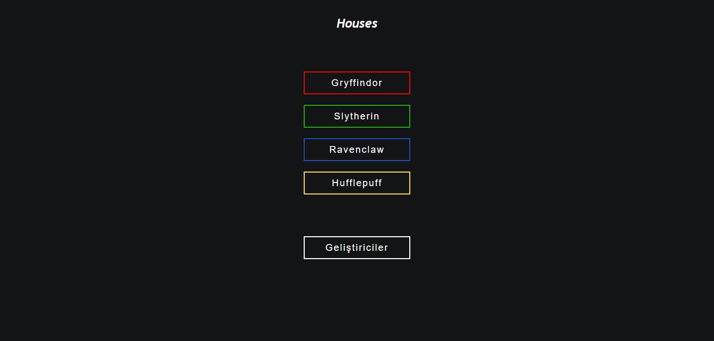

# PotterHouse

## PotterHouse Nedir?
[PotterHouse](https://hp.yagizyasak.me), Harry Potter'daki House'lar hakkında bilgi veren bir proje.

## PotterHouse API
PotterHouse'daki karakterlerin bilgilerini çekmek için bir API yazdık. Yazdığımız API'ler:

 - **[Gryffindor API](https://api.npoint.io/b3c80da1a27457a41a3a)**
 - **[Slytherin API](https://api.npoint.io/d2025e460e436619399e)**
 - **[Ravenclaw API](https://api.npoint.io/7cf313cca3c889cede84)**
 - **[Hufflepuff API](https://api.npoint.io/448301814612036998cc)**

PotterHouse API'yi yazarken **[hp-api](https://github.com/bethfraser/hp-api)**'deki bazı bilgilerden yararlandık.

## API'nın Verdiği Bilgiler
Karakterlerin;
 - Gerçek İsimleri,
 - Cinsiyetleri,
 - Hangi House'da bulunduğu,
 - Doğum Tarihleri,
 - Asa Özellikleri,
 - Instagram Hesapları,
 - Göz Rengi,
 - Doğum Yılı,
 - Patronus,
 - Hayatta olup olmadıkları,
 - Resimleri hakkında bilgi verir.

## Geliştiriciler
 - [Muzaffer Yağız Yasak](https://github.com/codermyagiz) -Html, CSS, JS, API
 - [Betül Araz](https://twitter.com/bethiestrange) -Karakterler Hakkında Bilgi
